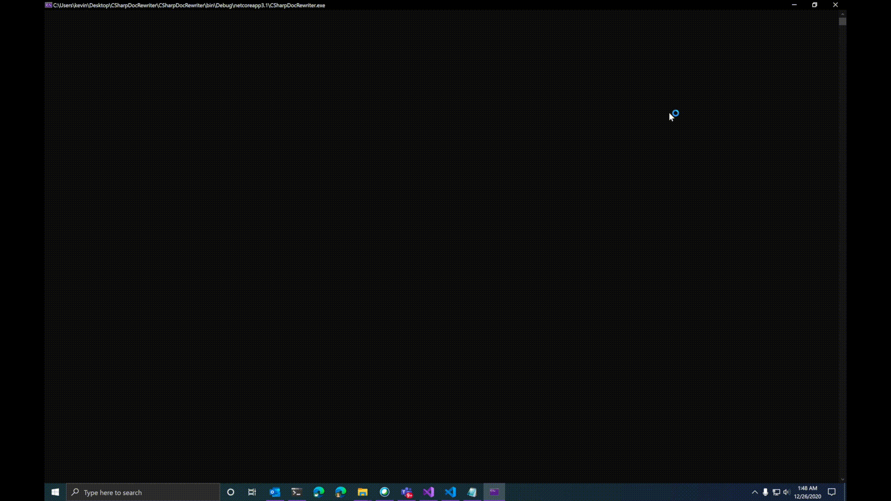

# CSharpDocRewriter
A Roslyn-powered tool for rewriting C# XML documentation comments with a Vim front-end.

<p align="center">
  
</p>

## Details
This tools iterates over all XML doc comments in the provided source file(s) one-by-one,
opening each for manual editing in Vim, alongside the corresponding source-code element.

Predefined macros make it easy to quickly edit C# XML doc tags.

Save your progress and exit. Pick up where you left off.

## Usage

```
CSharpDocRewriter.exe [csharp_file...]
```

Instruction is given in the tool.

### Save file
By default, a savestate is created in the current working directory.

Set `REWRITER_SAVE_LOCATION` to a custom Windows file path, if desired.

## Requirements
Only runs on Windows with **Ubuntu** Windows Subsystem for Linux (WSL) installed.

### Why?
Limited time. Please contribute :)